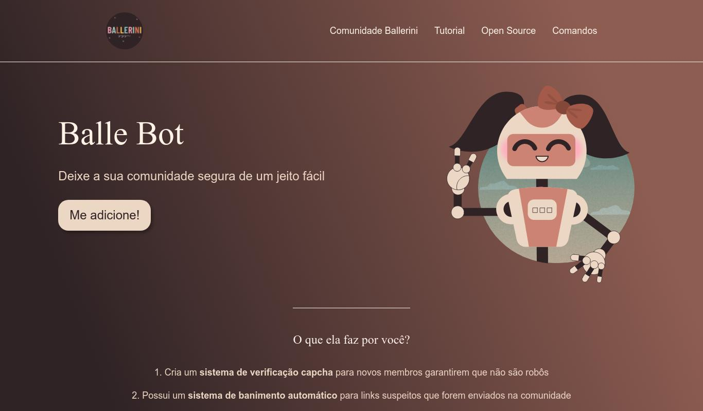

# 03:03 Configurando o ambiente

Crie uma pasta para o projeto

Abra o VSCode

# 04:54 Iniciando com o HTML

Crie arquivo index.html
! + tab ira aparecer o código abaixo

```html
<!DOCTYPE html>
<html lang="en">
<head>
    <meta charset="UTF-8">
    <meta http-equiv="X-UA-Compatible" content="IE=edge">
    <meta name="viewport" content="width=device-width, initial-scale=1.0">
    <title>Document</title>
</head>
<body>
    
</body>
</html>
```

# 05:55 - Head + metadados do HTML

Modifique o HTML
```html
<!DOCTYPE html>
<html lang="pt-BR">
<head>
    <meta charset="UTF-8">
    <meta name="viewport" content="width=device-width, initial-scale=1.0">
    <meta name="description" content="Um bot que irá moderar e deixar a sua comunidade segura de um jeito fácil">
    <title>Balle Bot - Modere a sua comunidade do Discord</title>
</head>

<body>
    
</body>

</html>
```

# 09:04 - Body + tags semânticas do HTML
Divida o site em 3 partes

Header
main
Footer

```html
<!DOCTYPE html>
<html lang="pt-BR">
<head>
    <meta charset="UTF-8">
    <meta name="viewport" content="width=device-width, initial-scale=1.0">
    <meta name="description" content="Um bot que irá moderar e deixar a sua comunidade segura de um jeito fácil">
    <title>Balle Bot - Modere a sua comunidade do Discord</title>
</head>

<body>

</body>

</html>
```

# 10:54 - Cabeçalho do HTML + Live Server

Adicione tags header main footer
```html
    <header>
        
    </header>

    <main> 

    </main>

    <footer> 

    </footer> 
```

Add
```html
    
    <nav>
        <a>Comunidade Ballerini</a>
        <a>Tutorial</a>
        <a>Open Source</a>
        <a>Comandos</a>
```
crie o arquivo logo.svg

Add
```html
    
```
Code

```html
<!DOCTYPE html>
<html lang="pt-BR">
<head>
    <meta charset="UTF-8">
    <meta name="viewport" content="width=device-width, initial-scale=1.0">
    <meta name="description" content="Um bot que irá moderar e deixar a sua comunidade segura de um jeito fácil">
    <title>Balle Bot - Modere a sua comunidade do Discord</title>
</head>

<body>
    <header>
        
        <nav>
            <a>Comunidade Ballerini</a>
            <a>Tutorial</a>
            <a>Open Source</a>
            <a>Comandos</a>
    </header>

    <main> 

    </main>

    <footer> 

    </footer> 
</body>

</html>
```
# 15:30 - Conteúdo principal do HTML
Crie dois sections
```html
        <section>

        </section>

        <section>
            
        </section>
```
add
```html
            <div>
                <h1>Balle Bot</h1>
                <h2>Deixe a sua comunidade segura de um jeito fácil</h2>
                <button>Me adicione</button>
            </div>
```
add img ballebot
```html
           
```
add section
```html
            <h3>O que ela faz por você?</h3>
            <p>1. Cria um sistema de verificação capcha para novos membros garantirem que não são robôs</p>
            <p>2. Possui um sistema de banimento automático para links suspeitos que forem enviados na comunidade</p>
            <p>3.Sistema de avisos e banimento manual, para pessoas administradoras utilizarem</p>
```

code
```html
<!DOCTYPE html>
<html lang="pt-BR">

<head>
    <meta charset="UTF-8">
    <meta name="viewport" content="width=device-width, initial-scale=1.0">
    <meta name="description" content="Um bot que irá moderar e deixar a sua comunidade segura de um jeito fácil">
    <title>Balle Bot - Modere a sua comunidade do Discord</title>
</head>

<body>
    <header>
        
        <nav>
            <a>Comunidade Ballerini</a>
            <a>Tutorial</a>
            <a>Open Source</a>
            <a>Comandos</a>
    </header>

    <main>
        <section>
            <div>
                <h1>Balle Bot</h1>
                <h2>Deixe a sua comunidade segura de um jeito fácil</h2>
                <button>Me adicione</button>
            </div>
            
        </section>

        <section>
            <h3>O que ela faz por você?</h3>
            <p>1. Cria um sistema de verificação capcha para novos membros garantirem que não são robôs</p>
            <p>2. Possui um sistema de banimento automático para links suspeitos que forem enviados na comunidade</p>
            <p>3.Sistema de avisos e banimento manual, para pessoas administradoras utilizarem</p>
        </section>
    </main>

    <footer>

    </footer>
</body>

</html>
```
# 19:04 - Footer do HTML
add img ballerini
```html
           
```
# 19:55 - Detalhes visuais da página
Add <strong>
```html
           <p>1. Cria um <strong>de verificação capcha</strong> para novos membros garantirem que não são robôs</p>
            <p>2. Possui um <strong>sistema de banimento automático</strong> para links suspeitos que forem enviados na comunidade</p>
            <p>3. <strong>Sistema de avisos e banimento manual</strong>, para pessoas administradoras utilizarem</p>
```
# 20:37 - Iniciando com CSS e adicionando as classes
crie um arquivo style.css

codigo
```html
    <!DOCTYPE html>
<html lang="pt-BR">

<head>
    <meta charset="UTF-8">
    <meta name="viewport" content="width=device-width, initial-scale=1.0">
    <meta name="description" content="Um bot que irá moderar e deixar a sua comunidade segura de um jeito fácil">
    <title>Balle Bot - Modere a sua comunidade do Discord</title>
</head>

<body>
    <header class="cabecalho">
        
        <nav class="cabecalho-menu">
            <a class="cabecalho-menu-item">Comunidade Ballerini</a>
            <a class="cabecalho-menu-item">Tutorial</a>
            <a class="cabecalho-menu-item">Open Source</a>
            <a class="cabecalho-menu-item">Comandos</a>
    </header>

    <main class="conteudo">
        <section class="conteudo-principal">
            <div class="conteudo-principal-escrito">
                <h1 class="conteudo-principal-escrito-titulo">Balle Bot</h1>
                <h2 class="conteudo-principal-escrito-subtitulo">Deixe a sua comunidade segura de um jeito fácil</h2>
                <button class="conteudo-principal-escrito-botao">Me adicione</button>
            </div>
        
        </section>

        <section class="conteudo-secundario">
            <h3 class="conteudo-secundario-titulo">O que ela faz por você?</h3>
            <p class="conteudo-secundario-paragrafo">1. Cria um <strong>de verificação capcha</strong> para novos membros garantirem que não são robôs</p>
            <p class="conteudo-secundario-paragrafo">2. Possui um <strong>sistema de banimento automático</strong> para links suspeitos que forem enviados na comunidade</p>
            <p class="conteudo-secundario-paragrafo">3. <strong>Sistema de avisos e banimento manual</strong>, para pessoas administradoras utilizarem</p>
        </section>
    </main>

    <footer class="rodape">
        
    </footer>
</body>

</html>
```
# 22:28 - Importanto fontes no Google Fonts
```css
@import url('https://fonts.googleapis.com/css2?family=Righteous&family=Sarala:wght@400;700&display=swap');
```
# 25:05 - Reset CSS: apagando pré configurações
```css
* {
    margin: 0;
    padding: 0;
    box-sizing: border-box;
    text-decoration: none;
}
```
# 27:01 - Estilizando o body
```css
* {
    margin: 0;
    padding: 0;
    box-sizing: border-box;
    text-decoration: none;
}
```
# 27:40 - Importanto o CSS no HTML
```css
body {
    font-size: 100%;
    background: linear-gradient(68.15deg, #2F2325 16.62%, #8E5D52 85.61%);
}
```
```html
<link rel="stylesheet" type="text/css" href="style.css">
```
# 28:38 - Estilizando o cabeçalho
```css
.cabecalho {
  display: flex;
  flex-direction: row;
  align-items: center;
  justify-content: space-around;
  padding: 24px;
}
```
# 29:26 - Flexbox: conceitos e como utilizar
```css
.cabecalho-imagem {
  height: 72px;
}
```
```css
.cabecalho-menu {
  display: flex;
  gap: 32px;
}
```
```css
.cabecalho-menu-item {
  font-family: 'Sarala', sans-serif;
  color: #FFF2E7;
  font-weight: 400;
  font-size: 18px
}
```
# 38:09 - Estilizando conteúdo principal pt 1
```css
.conteudo {
  margin-bottom: 48px;
  border-top: 0.4px solid #FFF2E7;
}
```

```css
.conteudo-principal {
  display: flex;
  flex-direction: row;
  align-items: center;
  justify-content: space-around;
}
```

```css
.conteudo-principal-escrito {
  display: flex;
  flex-direction: column;
  gap: 32px;
}
```

```css
.conteudo-principal-escrito-titulo {
  font-family: 'Righteous', cursive;
  font-weight: 400;
  font-size: 64px;
  color: #FFF2E7;
}
```
```css
.conteudo-principal-escrito-subtitulo {
  font-family: 'Sarala', sans-serif;
  font-weight: 400;
  font-size: 24px;
  color: #ECD6C4;
}
```

```css
.conteudo-principal-escrito-botao {
  background-color: #ECD6C4;
  width: 180px;
  height: 60px;
  border: none;
  box-shadow: 4px 5px 4px rgba(0, 0, 0, 0.25);
  border-radius: 20px;
  font-family: 'Sarala', sans-serif;
  font-weight: 400;
  font-size: 24px;
  color: #2F2325;
}
```
```css
.conteudo-principal-imagem {
  height: 430px;
}
```

# 51:22 - Estilizando conteúdo principal pt 2
```css
.conteudo-secundario {
  display: flex;
  flex-direction: column;
  align-items: center;
  gap: 24px;
  margin-top: 48px;
}

```
```css
.conteudo-secundario-titulo {
  border-top: 0.4px solid #FFF2E7;
  padding-top: 48px;
  font-family: 'Righteous', cursive;
  font-weight: 400;
  font-size: 24px;
  color: #FFF2EF;
  margin-bottom: 16px;
}
```
```css
.conteudo-secundario-paragrafo {
  font-family: 'Sarala', sans-serif;
  font-weight: 300;
  font-size: 18px;
  color: #ECD6C4;
}
```
# 56:16 - Estilizando o footer
```css
.rodape {
    padding: 32px;
    border-top: 0.4px solid #FFF2E7;
}
```
```css
.rodape-imagem {
  height: 48px;
  display: block;
  margin: 0 auto;
}
```
# 58:36 - Desafio

# 59:10 - Efeito hover: estilo ao passar o mouse por cima
```css
.conteudo-principal-escrito-botao:hover {
  background-color: rgba(236, 214, 196, 0.53);
}
```
# 1:00:35 - Adicionando links no menu
```html
<a class="cabecalho-menu-item" href="https://discord.gg/wagxzStdcR">Comunidade Ballerini</a>
```

# 1:01:15 - Finalização + cupom da Hostinger
